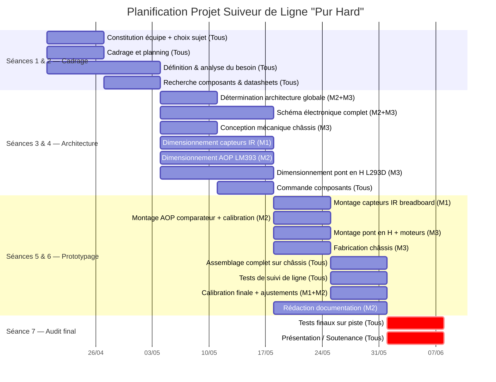

# Le Suiveur de Ligne "Pur Hard"

## Robot Suiveur de Ligne — Dossier Technique Hardware

> **Concept fondamental :** Créer un comportement "intelligent" sans une seule ligne de code.  
> La régulation se fait **entièrement par la physique** et l'électronique analogique.

---

## Table des matières

1. [Synoptique général du système](#1-synoptique-général-du-système)
2. [Capteurs infrarouges — Détection de ligne](#2-capteurs-infrarouges--détection-de-ligne)
3. [Étage de comparaison — AOP](#3-étage-de-comparaison--aop)
4. [Étage de puissance — Pont en H](#4-étage-de-puissance--pont-en-h)
5. [Motorisation](#5-motorisation)
6. [Alimentation](#6-alimentation)
7. [Châssis et mécanique](#7-châssis-et-mécanique)
8. [Nomenclature complète (BOM)](#8-nomenclature-complète-bom)
9. [Schémas électriques détaillés](#9-schémas-électriques-détaillés)
10. [Calibration et réglages](#10-calibration-et-réglages)
11. [Analyse des cas de fonctionnement](#11-analyse-des-cas-de-fonctionnement)
12. [Améliorations possibles](#12-améliorations-possibles)
13. [Planification & Répartition des tâches (Gantt + RACI)](#d-planification-du-projet--diagramme-de-gantt)

---

## 1. Synoptique général du système

```
┌──────────────┐     ┌──────────────────┐     ┌──────────────────┐     ┌─────────────┐
│  Capteurs IR │────▶│  AOP Comparateur │────▶│  Pont en H       │────▶│  Moteurs DC │
│  (x2 paires) │     │  (LM393 / LM358) │     │  (L293D / L298N  │     │  (x2)       │
│              │     │                  │     │   ou MOSFET)     │     │             │
└──────────────┘     └──────────────────┘     └──────────────────┘     └─────────────┘
        ▲                    ▲                                                │
        │                    │                                                │
   Réflexion IR         Potentiomètre                                   Roues motrices
   (sol noir/blanc)     de seuil                                        + roue folle
```

**Principe de fonctionnement en une phrase :**  
Les capteurs IR mesurent la réflectivité du sol → l'AOP compare ces mesures à un seuil → le résultat commande directement les moteurs via les transistors de puissance.

---

## 2. Capteurs infrarouges — Détection de ligne

### 2.1 Principe physique

Le capteur exploite la **réflexion diffuse** de la lumière infrarouge :

| Surface   | Comportement IR               | Tension phototransistor |
|-----------|-------------------------------|------------------------|
| **Blanche** | Forte réflexion → beaucoup de lumière reçue | **Haute** (proche de $V_{CC}$) |
| **Noire**   | Faible réflexion → peu de lumière reçue     | **Basse** (proche de 0V)      |

### 2.2 Structure d'un capteur

Chaque capteur est constitué d'une **paire émetteur/récepteur** :

```
     LED IR (émetteur)          Phototransistor (récepteur)
          │                              │
    ┌─────┴─────┐                  ┌─────┴─────┐
    │           │                  │           │
   VCC       R_led               VCC        R_pull-up
    │         (150Ω)              │          (10kΩ)
    │           │                  │           │
    └─────┬─────┘                  └─────┬─────┘──── V_out (vers AOP)
          │                              │
         GND                         Collecteur
                                         │
                                      Émetteur
                                         │
                                        GND
```

### 2.3 Composants recommandés

| Composant | Référence | Caractéristiques |
|-----------|-----------|-------------------|
| Paire IR émetteur/récepteur | **TCRT5000** | Distance optimale : 2–15 mm, longueur d'onde 950 nm |
| Alternative intégrée | **QRD1114** | Compact, sortie analogique directe |
| LED IR seule | **IR333** | $\lambda$ = 940 nm, $I_F$ = 20 mA |
| Phototransistor seul | **PT333** | Sensibilité maximale à 940 nm |

### 2.4 Calcul de la résistance de limitation LED IR

$$R_{LED} = \frac{V_{CC} - V_F}{I_F} = \frac{5V - 1.2V}{20mA} = 190\,\Omega \approx 220\,\Omega$$

### 2.5 Positionnement des capteurs

```
          ┌─────────────────────┐
          │     Châssis         │
          │                     │
          │  [Capteur G]   [Capteur D]  ← Espacement : 15–25 mm
          │      ↓              ↓         (à ajuster selon largeur de ligne)
══════════╪══════╪══════════════╪════════════════
          │  LIGNE NOIRE        │
══════════╪═════════════════════╪════════════════
```

- **Hauteur par rapport au sol :** 3–10 mm (optimal : 5 mm pour le TCRT5000)
- **Espacement entre capteurs :** légèrement supérieur à la largeur de la ligne (typiquement 20 mm pour une ligne de 18 mm)

---

## 3. Étage de comparaison — AOP

### 3.1 Rôle

L'amplificateur opérationnel est utilisé en **mode comparateur** (boucle ouverte ou avec hystérésis). Il transforme le signal analogique des capteurs en un signal **tout ou rien** (logique) pour commander les moteurs.

### 3.2 Fonctionnement en comparateur simple

```
                    VCC
                     │
                     R1 (10kΩ)
                     │
        V_capteur ──▶(+)     ┌───┐
                           │AOP├──── V_out
        V_seuil ────▶(−)     └───┘
                                │
                               GND
```

$$V_{out} = \begin{cases} V_{CC} & \text{si } V_{capteur} > V_{seuil} \quad \text{(surface blanche)} \\ 0\,V & \text{si } V_{capteur} < V_{seuil} \quad \text{(surface noire)} \end{cases}$$

### 3.3 Réglage du seuil — Diviseur de tension avec potentiomètre

```
        VCC (5V)
         │
        ┌┤ Potentiomètre
        ││ 10kΩ
        └┤───────── V_seuil (vers entrée − de l'AOP)
         │
        GND
```

$$V_{seuil} = V_{CC} \times \frac{R_{bas}}{R_{total}} \quad \text{(ajustable de 0 à } V_{CC}\text{)}$$

Le potentiomètre permet de calibrer le robot en fonction :
- Du contraste de la piste
- De la luminosité ambiante
- De la hauteur des capteurs

### 3.4 Comparateur avec hystérésis (anti-oscillation)

Pour éviter les oscillations quand le capteur est à la frontière noir/blanc, on ajoute une **rétroaction positive** :

```
                  R2 (100kΩ)
        ┌─────────────────────────┐
        │                         │
        │    V_capteur ──▶(+)     │    ┌───┐
        └────────────────────(+)  │AOP├──── V_out
             V_seuil ────▶(−)     └───┘
```

Seuils d'hystérésis :

$$V_{seuil,haut} = V_{seuil} + \Delta V = V_{seuil} + V_{CC} \times \frac{R_1}{R_1 + R_2}$$

$$V_{seuil,bas} = V_{seuil} - \Delta V$$

**Valeur recommandée :** Hystérésis de 50–200 mV (ajuster $R_2$ entre 100 kΩ et 1 MΩ).

### 3.5 Choix du composant AOP

| Composant | Type | Alimentation | Nb comparateurs | Avantage |
|-----------|------|-------------|-----------------|----------|
| **LM393** | Comparateur dédié | 2–36V | 2 | Sortie collecteur ouvert, rapide |
| **LM358** | AOP généraliste | 3–32V | 2 | Polyvalent, rail-to-rail en sortie (proche GND) |
| **LM324** | AOP généraliste | 3–32V | 4 | 4 canaux si besoin d'extension |

**Recommandation :** Le **LM393** est le choix idéal car c'est un vrai comparateur (temps de réponse ~1.3 µs vs ~20 µs pour un AOP).

> **Note :** La sortie collecteur ouvert du LM393 nécessite une **résistance de pull-up** (4.7kΩ – 10kΩ vers $V_{CC}$).

---

## 4. Étage de puissance — Pont en H

### 4.1 Rôle

Le pont en H permet de :
- **Contrôler le sens de rotation** des moteurs (avant/arrière)
- **Fournir le courant nécessaire** aux moteurs (les AOP ne peuvent pas alimenter directement un moteur)

### 4.2 Architecture du pont en H discret (MOSFET)

```
         VCC_moteur (6-12V)
          │                │
         Q1 (P-MOS)       Q3 (P-MOS)
          │                │
          ├────[MOTEUR]────┤
          │                │
         Q2 (N-MOS)       Q4 (N-MOS)
          │                │
         GND              GND
```

| Commande | Q1 | Q2 | Q3 | Q4 | Action moteur |
|----------|----|----|----|----|---------------|
| Avant    | ON | OFF | OFF | ON | Tourne sens horaire |
| Arrière  | OFF | ON | ON | OFF | Tourne sens anti-horaire |
| Freinage | OFF | ON | OFF | ON | Court-circuit = frein |
| Roue libre | OFF | OFF | OFF | OFF | Libre |

### 4.3 MOSFET recommandés

| Type | Référence | $V_{DS}$ | $I_D$ | $R_{DS(on)}$ |
|------|-----------|----------|--------|---------------|
| N-Channel | **IRLZ44N** | 55V | 47A | 22 mΩ |
| N-Channel (petit) | **IRF540N** | 100V | 33A | 44 mΩ |
| P-Channel | **IRF9540N** | -100V | -23A | 117 mΩ |

> **Important :** Choisir des MOSFET **logic-level** ($V_{GS(th)}$ < 3V) pour les piloter directement depuis la sortie de l'AOP à 5V.

### 4.4 Solution intégrée — Driver de pont en H

Pour simplifier le montage, des circuits intégrés dédiés existent :

| Composant | Tension moteur | Courant max | Nb moteurs | Protection thermique |
|-----------|---------------|-------------|------------|---------------------|
| **L293D** | 4.5–36V | 600 mA (1.2A crête) | 2 | Oui |
| **L298N** | 5–46V | 2A par canal | 2 | Non (ajouter dissipateur) |
| **TB6612FNG** | 2.5–13.5V | 1.2A (3.2A crête) | 2 | Oui |

**Recommandation :** Le **L293D** est le plus simple pour un prototype (diodes de protection intégrées). Pour des moteurs plus puissants, opter pour le **L298N** avec dissipateur thermique.

### 4.5 Schéma avec L293D

```
                      L293D
              ┌─────────────────┐
              │                 │
  AOP_G ────▶│ IN1         OUT1├───┐
              │                 │   │
         GND─│ IN2         OUT2├───┤── MOTEUR GAUCHE
              │                 │
  AOP_D ────▶│ IN3         OUT3├───┐
              │                 │   │
         GND─│ IN4         OUT4├───┤── MOTEUR DROIT
              │                 │
        VCC──│ EN1,2    VS (Vmot)│── VCC_moteur
              │ EN3,4           │
              └─────────────────┘
```

### 4.6 Diodes de roue libre

Si vous utilisez un pont en H discret (MOSFET), il est **impératif** d'ajouter des **diodes de roue libre** en antiparallèle sur chaque MOSFET pour protéger contre les surtensions induites par les moteurs (effet self).

$$V_{pic} = -L \times \frac{dI}{dt} \quad \text{(peut atteindre plusieurs dizaines de volts)}$$

Diodes recommandées : **1N4007** (1A) ou **Schottky 1N5819** (réponse plus rapide).

---

## 5. Motorisation

### 5.1 Choix des moteurs

| Paramètre | Valeur recommandée |
|------------|-------------------|
| Type | Moteur DC à balais avec réducteur |
| Tension | 3–6V ou 6–12V |
| Référence typique | **GA12-N20** (micro-motoréducteur) ou **moteur "TT" jaune** (hobby) |
| Rapport de réduction | 1:48 à 1:100 |
| Vitesse | 100–300 RPM (après réduction) |
| Couple | 0.5–1.5 kg·cm |
| Courant à vide | 70–150 mA |
| Courant en charge | 250–700 mA |

### 5.2 Configuration différentielle

Le robot utilise deux moteurs indépendants en **commande différentielle** :

```
        ┌──────────────────────┐
        │                      │
   [M_G]│                      │[M_D]
    ◄──── Roue gauche    Roue droite ────►
        │                      │
        │       [Roue folle]   │
        │          ○           │
        └──────────────────────┘
```

| Situation | Moteur Gauche | Moteur Droit | Trajectoire |
|-----------|--------------|-------------|-------------|
| Sur la ligne | ON | ON | Tout droit |
| Ligne dérive à gauche | OFF / Arrière | ON | Tourne à gauche |
| Ligne dérive à droite | ON | OFF / Arrière | Tourne à droite |
| Ligne perdue | OFF | OFF | Arrêt |

---

## 6. Alimentation

### 6.1 Architecture d'alimentation

> **Règle critique :** Séparer l'alimentation logique (capteurs + AOP) de l'alimentation moteurs pour éviter les parasites.

```
   ┌──────────────────────┐
   │  Batterie             │
   │  (7.4V LiPo 2S)     │
   │  ou 6x AA (9V)      │
   └─────────┬────────────┘
             │
     ┌───────┴───────┐
     │               │
  [Régulateur      [Direct]
   7805 → 5V]        │
     │             VCC_moteur
  VCC_logique       (6–9V)
  (capteurs,
   AOP)
```

### 6.2 Composants

| Élément | Référence | Spécification |
|---------|-----------|---------------|
| Régulateur 5V | **LM7805** | $V_{in}$ : 7–25V, $I_{out}$ : 1A max |
| Condensateurs de découplage | Céramique **100 nF** + Électrolytique **100 µF** | À placer au plus près du régulateur et des CI |
| Batterie LiPo | 2S (7.4V), 1000–2200 mAh | Légère, bonne capacité |
| Alternative piles | 6 × AA (9V) ou 4 × AA (6V direct) | Facile, économique |
| Interrupteur | Interrupteur à glissière | Coupure générale |

### 6.3 Bilan de consommation estimé

| Bloc | Courant estimé |
|------|---------------|
| 2 × LED IR | 2 × 20 mA = 40 mA |
| 2 × Phototransistor | ~5 mA |
| AOP (LM393) | ~2.5 mA |
| 2 × Moteurs (charge) | 2 × 400 mA = 800 mA |
| **Total estimé** | **~850 mA** |

Autonomie avec LiPo 2S 1500 mAh : environ **1h30 à 2h** de fonctionnement.

---

## 7. Châssis et mécanique

### 7.1 Dimensions recommandées

| Paramètre | Valeur |
|-----------|--------|
| Longueur | 120–180 mm |
| Largeur | 100–150 mm |
| Hauteur | 40–80 mm |
| Poids total cible | 200–500 g |

### 7.2 Matériaux possibles

| Matériau | Avantages | Inconvénients |
|----------|-----------|---------------|
| **Plexiglas / Acrylique** (3 mm) | Transparent, découpe laser, propre | Cassant sous choc |
| **MDF / Contreplaqué** (3 mm) | Bon marché, découpe laser facile | Lourd, sensible à l'humidité |
| **PLA (impression 3D)** | Forme libre, reproductible | Nécessite imprimante 3D |
| **PCB (circuit imprimé comme châssis)** | Ultra-compact, intègre le circuit | Conception plus complexe |

### 7.3 Architecture mécanique

```
        VUE DE DESSUS
   ┌───────────────────────┐
   │ ┌─────┐       ┌─────┐│
   │ │ M_G │       │ M_D ││   ← Moteurs + roues
   │ └──┬──┘       └──┬──┘│
   │    ●               ●  │   ← Roues motrices (Ø 42–65 mm)
   │                       │
   │  [Batterie]           │
   │                       │
   │  [PCB / Breadboard]   │
   │                       │
   │  [Capteur G] [Capteur D]│  ← À l'avant, proche du sol
   │        ○              │   ← Roue folle (bille ou roulette)
   └───────────────────────┘
        AVANT DU ROBOT
```

### 7.4 Roue folle / Roulette

| Type | Référence | Avantage |
|------|-----------|----------|
| **Bille castor** | Ball caster (Pololu) | Omnidirectionnelle, compact |
| **Roulette pivotante** | Roulette miniature | Stable, bon marché |

---

## 8. Nomenclature complète (BOM)

### 8.1 Composants électroniques

| # | Composant | Référence | Quantité | Rôle |
|---|-----------|-----------|----------|------|
| 1 | Capteur IR | TCRT5000 | 2 | Détection de ligne |
| 2 | Résistance 220Ω | 1/4W | 2 | Limitation courant LED IR |
| 3 | Résistance 10kΩ | 1/4W | 4 | Pull-up phototransistor + diviseur seuil |
| 4 | Résistance 4.7kΩ | 1/4W | 2 | Pull-up sortie LM393 |
| 5 | Potentiomètre 10kΩ | Multitour | 2 | Réglage seuil de détection |
| 6 | Comparateur | LM393 | 1 | Comparaison capteur/seuil |
| 7 | Pont en H | L293D | 1 | Commande moteurs |
| 8 | Condensateur 100nF | Céramique | 4 | Découplage |
| 9 | Condensateur 100µF | Électrolytique 16V | 2 | Filtrage alimentation |
| 10 | Régulateur 5V | LM7805 | 1 | Alimentation logique |
| 11 | Diode | 1N4007 | 4 | Protection (si pont H discret) |
| 12 | LED témoin | Rouge 3mm | 2 | Indicateur sortie AOP (optionnel) |
| 13 | Résistance 1kΩ | 1/4W | 2 | LED témoin (optionnel) |
| 14 | Interrupteur | Glissière | 1 | Marche/arrêt |

### 8.2 Composants mécaniques

| # | Composant | Quantité | Rôle |
|---|-----------|----------|------|
| 1 | Moteur DC avec réducteur | 2 | Propulsion |
| 2 | Roue (Ø 42–65 mm) | 2 | Traction |
| 3 | Roue folle (ball caster) | 1 | Appui avant |
| 4 | Platine châssis | 1 | Structure |
| 5 | Supports moteur | 2 | Fixation moteurs |
| 6 | Vis M3 + écrous | ~10 | Assemblage |
| 7 | Entretoises | 4 | Espacement étages |

### 8.3 Alimentation

| # | Composant | Quantité | Rôle |
|---|-----------|----------|------|
| 1 | Batterie LiPo 2S 7.4V | 1 | Source d'énergie |
| 2 | Connecteur batterie | 1 | Raccordement |
| 3 | Support de piles AA (alt.) | 1 | Alternative batterie |

---

## 9. Schémas électriques détaillés

### 9.1 Schéma global — Circuit complet

```
    VCC (5V)          VCC (5V)             VCC (5V)        VCC_mot (6-9V)
      │                  │                    │                │
     ┌┤R1               ┌┤R3                 ┌┤R_pull-up      │
     ││220Ω             ││220Ω               ││4.7kΩ          │
     └┤                 └┤                   └┤               │
      │                  │                    │               │
    LED_IR_G           LED_IR_D               ├───────┐       │
      │                  │                    │       │       │
     GND               GND              ┌────┴──┐    │       │
                                         │ LM393 │    │       │
    VCC                VCC               │       │    │       │
      │                  │               │  1/2  │    │       │
     ┌┤R2               ┌┤R4             │       │    │       │
     ││10kΩ             ││10kΩ            └──┬────┘    │       │
     └┤                 └┤                   │        │       │
      │                  │                   │        │       │
   Photo_G ──(+)─┐   Photo_D──(+)─┐         │     ┌──┴──┐    │
      │          │AOP1│    │       │AOP2│     │     │     │    │
   V_seuil──(−)─┘    │ V_seuil──(−)─┘   │     │     │L293D│────┤
      │          OUT──┼──────────────OUT──┼─────┤     │     │    │
      │               │                  │     │     │     │    │
     GND             GND               GND   IN1/2  IN3/4  VS │
                                                │     │       │
                                              MOT_G  MOT_D    │
                                                │     │       │
                                               GND   GND    GND
```

### 9.2 Détail — Un canal capteur + comparateur

```
         VCC (5V)                         VCC (5V)
          │                                │
         [220Ω]                          [10kΩ]
          │                                │
        LED IR ─── (vers sol) ───▶ Phototransistor
          │                                │
         GND                               ├──────▶ (+) LM393
                                           │              │
                                          GND         [4.7kΩ] pull-up ── VCC
                                                          │
                   VCC                                    OUT ──▶ vers L293D (INx)
                    │
                 [POT 10kΩ]
                    │
                    ├──────▶ (−) LM393
                    │
                   GND
```

---

## 10. Calibration et réglages

### 10.1 Procédure de calibration

| Étape | Action | Outil nécessaire |
|-------|--------|------------------|
| 1 | Placer le robot sur la **surface blanche** (hors de la ligne) | Multimètre |
| 2 | Mesurer $V_{capteur}$ à la sortie de chaque phototransistor | Multimètre |
| 3 | Placer le robot sur la **ligne noire** | Multimètre |
| 4 | Mesurer $V_{capteur}$ à nouveau | Multimètre |
| 5 | Le seuil ($V_{seuil}$) doit être réglé **entre** ces deux valeurs | Tournevis (potentiomètre) |
| 6 | Valeur idéale : $V_{seuil} = \frac{V_{blanc} + V_{noir}}{2}$ | Calcul |

### 10.2 Valeurs typiques mesurées

| Condition | Tension phototransistor (TCRT5000 à 5 mm) |
|-----------|--------------------------------------------|
| Surface blanche | 3.5 – 4.5 V |
| Surface noire | 0.3 – 1.0 V |
| **Seuil recommandé** | **~2.0 – 2.5 V** |

### 10.3 Points de vigilance

- **Lumière ambiante :** Les néons et la lumière solaire directe peuvent perturber les capteurs IR. Si possible, ajouter un **capot opaque** autour des capteurs.
- **Hauteur capteur-sol :** Vérifier que la distance est constante (3–8 mm). Un capteur trop haut donnera un signal faible.
- **Couleur de la ligne :** Le contraste doit être fort (noir mat sur blanc mat). Les surfaces brillantes créent des réflexions spéculaires.
- **Symétrie des capteurs :** Les deux canaux doivent être calibrés avec des seuils proches mais indépendants pour compenser les tolérances composants.

---

## 11. Analyse des cas de fonctionnement

### 11.1 Tableau de vérité logique

| Capteur Gauche | Capteur Droit | Sortie AOP G | Sortie AOP D | Moteur G | Moteur D | Action |
|:---:|:---:|:---:|:---:|:---:|:---:|---|
| Blanc | Blanc | HIGH | HIGH | ON | ON | **Tout droit** (sur la ligne, centrée entre les capteurs) |
| Noir | Blanc | LOW | HIGH | OFF | ON | **Tourne à gauche** (ligne sous capteur gauche) |
| Blanc | Noir | HIGH | LOW | ON | OFF | **Tourne à droite** (ligne sous capteur droit) |
| Noir | Noir | LOW | LOW | OFF | OFF | **Arrêt** (ligne perdue ou croisement) |

> **Convention :** La ligne est **noire** sur fond **blanc**. Les capteurs sont positionnés de part et d'autre de la ligne.

### 11.2 Logique de suivi expliquée

```
     Cas 1: CENTRÉ              Cas 2: DÉRIVE GAUCHE         Cas 3: DÉRIVE DROITE
     ──────────────             ─────────────────            ──────────────────

   [CG]  ligne  [CD]          [CG]  ligne  [CD]           [CG]  ligne  [CD]
    │     ███     │            ███    │      │              │      │    ███
    │     ███     │            ███    │      │              │      │    ███
   Blanc  Noir  Blanc         Noir  Blanc  Blanc          Blanc  Blanc  Noir
    ↓      ↓     ↓             ↓      ↓     ↓              ↓      ↓     ↓
   MG: ON       MD: ON       MG: OFF      MD: ON         MG: ON       MD: OFF
      → TOUT DROIT               → TOURNE GAUCHE              → TOURNE DROITE
```

### 11.3 Temps de réponse du système

| Étage | Temps de réponse typique |
|-------|--------------------------|
| Capteur IR (TCRT5000) | ~15 µs |
| Comparateur (LM393) | ~1.3 µs |
| MOSFET (commutation) | ~50 ns |
| **Total chaîne** | **< 20 µs** |

Ce temps de réponse est **bien supérieur** à celui d'un système à microcontrôleur (qui nécessite conversion ADC + traitement + PWM, soit ~1–10 ms).

---

## 12. Améliorations possibles

### 12.1 Régulation proportionnelle (sans code)

Remplacer le mode comparateur par un **montage suiveur/amplificateur différentiel** qui module la tension envoyée aux moteurs proportionnellement à l'écart détecté → trajectoire plus douce.

```
   V_capteur_G ──▶(+)──┐
                        │ AOP (gain) ──▶ Commande moteur proportionnelle
   V_capteur_D ──▶(−)──┘
```

### 12.2 Ajout de capteurs supplémentaires

Passer de 2 à **4 ou 5 capteurs** pour anticiper les virages serrés. Chaque capteur pilote un étage de comparaison indépendant avec des pondérations résistives en sortie (réseau de résistances = DAC résistif rudimentaire).

### 12.3 Contrôle de vitesse (PWM hardware)

Utiliser un **oscillateur à base de timer 555** pour générer un signal PWM qui module la vitesse des moteurs via le pin ENABLE du L293D.

### 12.4 Détection d'intersection

Quand les **deux capteurs** voient du noir simultanément, le robot s'arrête. On peut ajouter une logique (portes ET/OU) pour gérer les intersections en T ou en croix.

---

## Annexes

### A. Brochage du LM393

```
        ┌───── U ─────┐
   OUT1 │1           8│ VCC
   IN1- │2           7│ OUT2
   IN1+ │3           6│ IN2-
   GND  │4           5│ IN2+
        └─────────────┘
```

### B. Brochage du L293D

```
        ┌───── U ─────┐
   EN1,2│1          16│ VCC1 (5V logique)
   IN1  │2          15│ IN4
   OUT1 │3          14│ OUT4
   GND  │4          13│ GND
   GND  │5          12│ GND
   OUT2 │6          11│ OUT3
   IN2  │7          10│ IN3
   VCC2 │8           9│ EN3,4
(V_mot) └─────────────┘
```

### C. Formules clés récapitulatives

| Formule | Application |
|---------|-------------|
| $R = \frac{V_{CC} - V_F}{I_F}$ | Résistance de limitation LED |
| $V_{seuil} = V_{CC} \times \frac{R_2}{R_1 + R_2}$ | Diviseur de tension (seuil) |
| $P = V \times I$ | Puissance dissipée |
| $P_{MOSFET} = R_{DS(on)} \times I_D^2$ | Pertes par conduction MOSFET |
| $\Delta V_{hyst} = V_{CC} \times \frac{R_1}{R_1 + R_{feedback}}$ | Bande d'hystérésis |

---

## D. Planification du projet — Diagramme de Gantt

### D.1 Répartition de l'équipe

| Membre | Rôle principal | Responsabilités |
|--------|---------------|-----------------|
| **Membre 1** | Capteurs & Calibration | Conception capteurs IR, câblage émetteur/récepteur, calibration des seuils, tests de détection, réglage potentiomètres |
| **Membre 2** | Logique de contrôle (AOP) & Documentation | Montage AOP en comparateur, dimensionnement hystérésis, interfaçage capteurs → pont en H, validation logique, rédaction du dossier technique |
| **Membre 3** | Puissance, Motorisation & Châssis | Design pont en H (L293D ou MOSFET), câblage moteurs, alimentation (régulateur, découplage), conception et fabrication châssis, assemblage mécanique, intégration finale |

### D.2 Planning imposé par les enseignants

```
┌─────────────────┐    ┌─────────────────┐    ┌─────────────────┐    ┌─────────────────┐
│  Séances 1 & 2  │───▶│  Séances 3 & 4  │───▶│  Séances 5 & 6  │───▶│   Séance 7      │
│                 │    │                 │    │                 │    │                 │
│ • Constitution  │    │ • Détermination │    │ • Prototypage   │    │ • Audit final   │
│   équipes &     │    │   architecture  │    │ • Tests et      │    │                 │
│   choix sujets  │    │ • Définition    │    │   validation    │    │                 │
│ • Cadrage et    │    │   schéma élec.  │    │   du prototype  │    │                 │
│   planning      │    │ • Choix et dim. │    │                 │    │                 │
│ • Définition &  │    │   composants    │    │                 │    │                 │
│   analyse       │    │                 │    │                 │    │                 │
│   du besoin     │    │                 │    │                 │    │                 │
└─────────────────┘    └─────────────────┘    └─────────────────┘    └─────────────────┘
```

### D.3 Phases du projet (alignées sur les séances)

| Séance | Tâche | Resp. | S1 | S2 | S3 | S4 | S5 | S6 | S7 |
|--------|-------|-------|:--:|:--:|:--:|:--:|:--:|:--:|:--:|
| | **Séances 1 & 2 — Cadrage & Analyse du besoin** | | | | | | | | |
| S1 | Constitution équipe + choix du sujet | Tous | ██ | | | | | | |
| S1 | Cadrage et planning du projet | Tous | ██ | | | | | | |
| S1-S2 | Définition & analyse du besoin | Tous | ██ | ██ | | | | | |
| S2 | Recherche composants & datasheets | Tous | | ██ | | | | | |
| | **Séances 3 & 4 — Architecture & Dimensionnement** | | | | | | | | |
| S3 | Détermination architecture globale | M2 + M3 | | | ██ | | | | |
| S3-S4 | Définition schéma électronique complet | M2 + M3 | | | ██ | ██ | | | |
| S3 | Conception mécanique châssis | M3 | | | ██ | | | | |
| S3-S4 | Choix et dimensionnement capteurs IR | M1 | | | ██ | ██ | | | |
| S3-S4 | Choix et dimensionnement AOP (LM393) | M2 | | | ██ | ██ | | | |
| S3-S4 | Choix et dimensionnement pont en H (L293D) | M3 | | | ██ | ██ | | | |
| S4 | Commande composants | Tous | | | | ██ | | | |
| | **Séances 5 & 6 — Prototypage & Validation** | | | | | | | | |
| S5 | Montage capteurs IR sur breadboard | M1 | | | | | ██ | | |
| S5 | Montage AOP comparateur + calibration seuil | M2 | | | | | ██ | | |
| S5 | Montage pont en H + moteurs | M3 | | | | | ██ | | |
| S5 | Fabrication châssis | M3 | | | | | ██ | | |
| S6 | Assemblage complet sur châssis | Tous | | | | | | ██ | |
| S6 | Tests de suivi de ligne | Tous | | | | | | ██ | |
| S6 | Calibration finale + ajustements | M1 + M2 | | | | | | ██ | |
| S5-S6 | Rédaction documentation / dossier | M2 | | | | | ██ | ██ | |
| | **Séance 7 — Audit final** | | | | | | | | |
| S7 | Tests finaux sur piste devant jury | Tous | | | | | | | ██ |
| S7 | Présentation / soutenance | Tous | | | | | | | ██ |

### D.4 Diagramme de Gantt (Mermaid)



### D.5 Matrice de responsabilités (RACI)

> **R** = Responsable (fait le travail) · **A** = Approbateur (valide) · **C** = Consulté · **I** = Informé

| Tâche | Membre 1 (Capteurs) | Membre 2 (AOP & Doc) | Membre 3 (Puissance & Châssis) |
|-------|:---:|:---:|:---:|
| Recherche composants | R | R | R |
| Schéma électrique global | C | **R** | **R** |
| Conception châssis | C | I | **R** |
| Capteurs IR (montage + test) | **R** | C | I |
| AOP comparateur | C | **R** | I |
| Pont en H + moteurs | I | C | **R** |
| Alimentation (régulation) | I | C | **R** |
| Fabrication châssis | C | I | **R** |
| Calibration capteurs | **R** | **A** | I |
| Assemblage final | **R** | C | **R** |
| Tests suivi de ligne | R | R | R |
| Documentation | C | **R** | I |
| Préparation soutenance | R | R | R |

### D.6 Livrables par séance

| Séance | Livrable attendu | Critère de validation |
|--------|-----------------|----------------------|
| **Séances 1 & 2** | Cahier des charges + planning + analyse du besoin | Document validé par l'équipe |
| **Séances 3 & 4** | Schéma électronique complet + BOM + dimensionnement de tous les composants | Revue technique, calculs vérifiés |
| **Séances 5 & 6** | Prototype fonctionnel : robot suit une ligne | Démonstration sur piste de test |
| **Séance 7** | Robot finalisé + dossier technique + soutenance | **Audit final devant jury** |

---

*Document technique rédigé dans le cadre du projet "Le Suiveur de Ligne Pur Hard" — Présentation jury*
